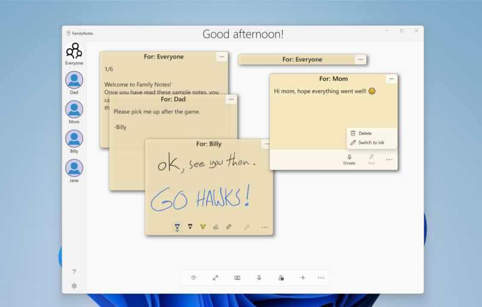
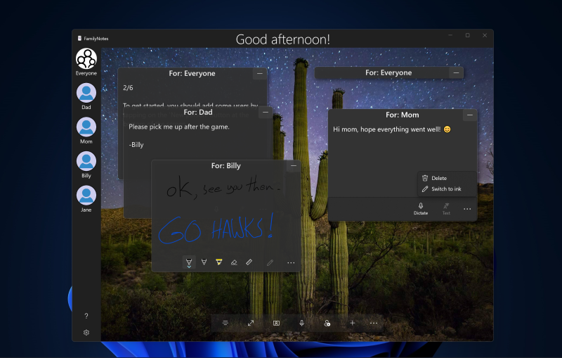

<!---
  category: AudioVideoAndCamera SpeechAndCortana Inking CustomUserInteractions AppSettings FilesFoldersAndLibraries Data
-->

# FamilyNotes sample

A mini-app that explores different input modalities and scenarios of user awareness. A bulletin-board app that allows family members to leave notes for each other on a common PC/tablet just like they would on a bulletin board. Using text, speech, or ink, a user can create a note and tag it for another user. Later, when that other user approaches the PC/tablet, the app uses imaging APIs and the Microsoft Cognitive Services (Face API) to detect their presence and display the notes that have been left for them, effectively filtering based on facial recognition. While the app is open, users can naturally interact with it using speech ("Add note for Bob").

> Note - This sample is targeted and tested for Windows 10, version 2004 (10.0; Build 19041), and Visual Studio 2019. It is also tested on Windows 11 (Build 22000). If you're using Windows 11, you can use project properties to retarget the project(s) to Windows 11 (Build 22000).

This sample runs on the Universal Windows Platform (UWP).

Be aware that the image understanding capabilities of the **FamilyNotes** app use Microsoft Cognitive Services. Microsoft will receive the images and other data that you upload (via this app) for service improvement purposes. To report abuse of the Azure Face service to Microsoft, please visit the Microsoft Cognitive Services website at www.microsoft.com/cognitive-services, and use the "Report Abuse" link at the bottom of the page to contact Microsoft. For more information about Microsoft privacy policies please see the privacy statement here: http://go.microsoft.com/fwlink/?LinkId=521839.

## Features

The FamilyNotes app demonstrates:

* Speech recognition and speech synthesis by using the [SpeechRecognizer](https://msdn.microsoft.com/library/windows/apps/windows.media.speechrecognition.speechrecognizer.aspx) and [SpeechSynthesizer](https://msdn.microsoft.com/library/windows/apps/windows.media.speechsynthesis.speechsynthesizer.aspx) classes.  
* User detection using the [MediaCapture](https://msdn.microsoft.com/library/windows/apps/windows.media.capture.mediacapture.aspx) and [FaceDetectionEffect](https://msdn.microsoft.com/library/windows/apps/windows.media.core.facedetectioneffect.aspx) classes.  
* User facial recognition using the [Azure Face service](https://docs.microsoft.com/en-us/azure/cognitive-services/face/).
* Control through voice commands, defined in VoiceCommands.xml (a [VCD](https://msdn.microsoft.com/library/windows/apps/dn706593) file), using [VoiceCommands](https://msdn.microsoft.com/library/windows/apps/Windows.ApplicationModel.VoiceCommands.aspx) and [Activation](https://msdn.microsoft.com/en-us/library/windows/apps/windows.applicationmodel.activation.aspx) classes.
* Pen input using the [InkCanvas API](https://msdn.microsoft.com/en-us/library/windows/apps/windows.ui.xaml.controls.inkcanvas.aspx).
* JSON serialization using the [DataContractJsonSerializer](https://msdn.microsoft.com/en-us/library/system.runtime.serialization.json.datacontractjsonserializer.aspx) class.
* Setting the app wallpaper using the [Bing image of the day task snippet](https://github.com/Microsoft/Windows-task-snippets/blob/master/tasks/Bing-image-of-the-day-URI.md).

## October 2021 update

This update includes:

* Update to WinUI 2.7 and the latest WinUI styles.
* The UI is redesigned to look at home on Windows 11, and rewritten to use the latest controls.
* Support for a dark theme and full-screen mode.
* Bug fixes and other improvements.

## June 2020 update

This update includes:

* Refactoring for WinUI 2.4 controls, specifically [PersonPicture](https://docs.microsoft.com/windows/apps/design/controls/person-picture).

## Universal Windows Platform development

### Prerequisites

* Windows 10 or Windows 11. Minimum: Windows 10, version 1809 (10.0; Build 17763), also known as the Windows 10 October 2018 Update.
* [Windows SDK](https://developer.microsoft.com/windows/downloads/windows-sdk). Minimum: Windows SDK version 10.0.19041.0 (Windows 10, version 1904).
* [Visual Studio 2019](https://visualstudio.microsoft.com/downloads/). You can use the free Visual Studio Community Edition to build and run Windows Universal Platform (UWP) apps.

To get the latest updates to Windows and the development tools, and to help shape their development, join 
the [Windows Insider Program](https://insider.windows.com).

## Running the sample

The default project is FamilyNotes and you can Start Debugging (F5) or Start Without Debugging (Ctrl+F5) to try it out. The app will run in the emulator or on physical devices, though functionality related to speech and face recognition is dependent on hardware support.

## Requirements 

* **User filtering by facial recognition requires:**
  * A front-facing camera or USB webcam.
  * A subscription key for the Azure Face service. For information about getting a free trial key, see the Azure Cognitive Services site.
  * A user created with a profile picture.  
    **Note:** The Azure Face service subscription key and endpoint must be entered in the Settings menu of the app before facial recognition can be used. The settings menu is opened by clicking the gear button on the apps navigation pane.
* **Speech recognition requires:**
  * A microphone and the appropriate settings enabled on the local machine.

## Articles

The FamilyNotes app illustrates a number of platform features. For more detailed articles about those features and their use within the app, see the following articles.

* [Data bind an InkCanvas control](DatabindInkCanvas.md)
* [Serializing the model and InkCanvas data](Serialization.md)
* [Using speech for note taking](Speech.md)
* [Using the camera, imaging, and the Microsoft Cognitive Services (Face API) for facial recognition](CameraImagingRecognition.md)

Also, some additional discussion and information about the original sample is available on the Windows Developer blog in the following posts.

* [FamilyNotes: Introducing a Windows UWP sample using ink, speech, and face recognition](https://blogs.windows.com/buildingapps/2016/06/21/familynotes-introducing-a-windows-uwp-sample-using-ink-speech-and-face-recognition/)  
* [FamilyNotes: Using the camera to detect a user](https://blogs.windows.com/buildingapps/2016/06/28/familynotes-using-the-camera-to-detect-a-user/)  
* [FamilyNotes: (Spoken) words and pictures](https://blogs.windows.com/buildingapps/2016/07/05/familynotes-spoken-words-and-pictures/)  

## Code at a glance

If you are interested in code snippets and don't want to browse or run the full sample, check out the following files for examples of some highlighted features:

* [Settings.cs](FamilyNotes/Settings.cs) : Downloads the Bing image of the day and allows for app config such as storing the developer key for the Azure Face service.
* [BindableInkCanvas.cs](FamilyNotes/Controls/BindableInkCanvas.cs) : An `InkCanvas` control with a bindable `InkStrokeContainer`.
* [Utils.cs](FamilyNotes/Utils.cs) : Delete a directory and its contents.
* [App.xaml.cs](FamilyNotes/App.xaml.cs) : Saves/loads the people and their notes. Demonstrates serialization and how to handle saving multiple `InkStrokeContainers` to a stream.
* [AddPersonContentDialog.xaml.cs](FamilyNotes/AppDialogs/AddPersonContentDialog.xaml.cs) : Contains the add person dialog, which has an option to take a snapshot for a user when adding him or her. This picture is taken using the [CameraCaptureUI](https://msdn.microsoft.com/en-us/library/windows/apps/windows.media.capture.cameracaptureui.aspx).
* [UserPresence.cs](FamilyNotes/UserDetection/UserPresence.cs) : Contains the code that is responsible for taking pictures in the background. These pictures are then used for user identification.
* [FacialSimilarity.cs](FamilyNotes/UserDetection/FacialSimilarity.cs) : Contains the code used to interact with the Azure Face service for the purpose of comparing a dynamically captured user image against a list of known users to obtain the most likely user present.

## See also

[Microsoft Cognitive Services](http://www.microsoft.com/cognitive-services)  
[Microsoft Cognitive Services samples](https://www.microsoft.com/cognitive-services/en-us/sdk-sample?author=microsoft&category=sample)
[Pen interactions and Windows Ink](https://docs.microsoft.com/windows/apps/design/input/pen-and-stylus-interactions)  
[Simple ink sample](http://go.microsoft.com/fwlink/p/?LinkID=620312)  
[Complex ink sample](http://go.microsoft.com/fwlink/p/?LinkID=620314)  
[Speech recognition and synthesis sample](https://github.com/Microsoft/Windows-universal-samples/tree/master/Samples/SpeechRecognitionAndSynthesis)  
[Voice command sample](http://go.microsoft.com/fwlink/p/?LinkId=619899)  
